# 智能体群组协作系统 - 流程图集

## 目录
1. [系统整体架构图](#1-系统整体架构图)
2. [用户交互流程图](#2-用户交互流程图)
3. [群组创建流程图](#3-群组创建流程图)
4. [群组协作任务执行流程图](#4-群组协作任务执行流程图)
5. [@提及选择流程图](#5-提及选择流程图)
6. [智能体配置流程图](#6-智能体配置流程图)
7. [Skill配置流程图](#7-skill配置流程图)
8. [数据流转关系图](#8-数据流转关系图)
9. [前后台模块关系图](#9-前后台模块关系图)

---

## 1. 系统整体架构图

```mermaid
graph TB
    subgraph "用户层"
        User[用户]
    end

    subgraph "前台应用层"
        Frontend[前台界面<br/>Frontend.tsx]
        Chat[群聊交互模块]
        GroupMgr[群组管理模块]
        Mention[@提及选择模块]
    end

    subgraph "后台管理层"
        Admin[后台管理]
        AgentMgr[智能体配置]
        SkillMgr[Skill管理]
        KnowledgeMgr[知识库管理]
        WorkflowMgr[工作流配置]
        APIMgr[API调试]
    end

    subgraph "核心业务层"
        Coordinator[调度引擎<br/>Coordinator]
        TaskEngine[任务编排引擎]
        MessageEngine[消息处理引擎]
    end

    subgraph "数据层"
        DB[(数据库)]
        Cache[(缓存)]
        Vector[(向量库)]
    end

    subgraph "AI服务层"
        LLM[大语言模型<br/>OpenAI/自建]
        Embedding[向量化服务]
    end

    User -->|使用| Frontend
    User -->|配置管理| Admin

    Frontend --> Chat
    Frontend --> GroupMgr
    Frontend --> Mention

    Admin --> AgentMgr
    Admin --> SkillMgr
    Admin --> KnowledgeMgr
    Admin --> WorkflowMgr
    Admin --> APIMgr

    Chat --> Coordinator
    GroupMgr --> DB
    AgentMgr --> DB
    SkillMgr --> DB

    Coordinator --> TaskEngine
    TaskEngine --> MessageEngine

    MessageEngine --> LLM
    MessageEngine --> DB
    MessageEngine --> Cache

    KnowledgeMgr --> Vector
    Vector --> Embedding

    style Frontend fill:#e1f5ff
    style Admin fill:#fff7e6
    style Coordinator fill:#f9f0ff
    style LLM fill:#f6ffed
```

---

## 2. 用户交互流程图

```mermaid
graph LR
    Start([用户进入系统]) --> Choice{选择操作}

    Choice -->|前台使用| FrontendFlow[前台交互流程]
    Choice -->|后台配置| AdminFlow[后台管理流程]

    FrontendFlow --> F1[选择智能体/群组]
    F1 --> F2[输入消息]
    F2 --> F3{是否使用@提及?}
    F3 -->|是| F4[打开@选择面板]
    F4 --> F5[选择目标]
    F5 --> F2
    F3 -->|否| F6[发送消息]
    F6 --> F7[查看智能体回复]
    F7 --> F8{是否满意?}
    F8 -->|是| End([结束])
    F8 -->|否| F9[重试/继续对话]
    F9 --> F2

    AdminFlow --> A1[配置智能体]
    A1 --> A2[配置Skill]
    A2 --> A3[创建群组]
    A3 --> End

    style FrontendFlow fill:#e1f5ff
    style AdminFlow fill:#fff7e6
```

---

## 3. 群组创建流程图

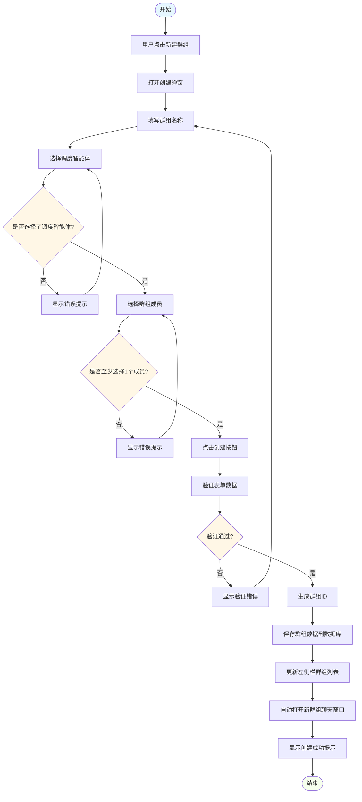

---

## 4. 群组协作任务执行流程图

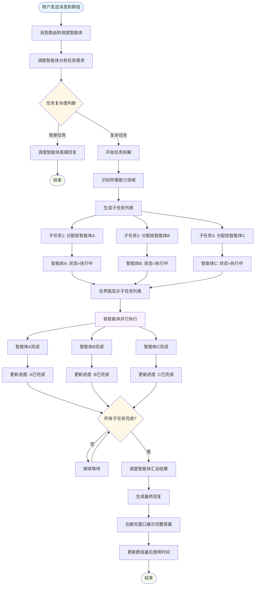

---

## 5. @提及选择流程图

```mermaid
flowchart TD
    Start([开始]) --> A{触发方式}

    A -->|输入@字符| B1[检测到@符号]
    A -->|点击@按钮| B2[用户点击@按钮]

    B1 --> C[触发提及面板]
    B2 --> C

    C --> D[计算弹窗位置]
    D --> E[渲染提及面板]
    E --> F[默认显示智能体标签页]

    F --> G[加载智能体列表]
    G --> H[按类别分组显示]

    H --> I{用户操作}

    I -->|切换到群组Tab| J[加载群组列表]
    J --> K[按最近使用时间排序]
    K --> I

    I -->|输入搜索关键词| L[实时过滤列表]
    L --> I

    I -->|点击选择目标| M{选择的类型?}

    M -->|智能体| N1[创建蓝色Mention节点]
    M -->|群组| N2[创建绿色Mention节点]

    N1 --> O[插入到光标位置]
    N2 --> O

    O --> P[关闭提及面板]
    P --> Q[光标移到插入内容后]
    Q --> R{用户继续操作}

    R -->|继续输入| S[正常输入文本]
    R -->|发送消息| T[包含@提及的消息发送]

    S --> End1([结束])
    T --> End2([结束])

    style Start fill:#e6f7ff
    style M fill:#fff7e6
    style N1 fill:#e6f7ff
    style N2 fill:#d9f7be
    style End1 fill:#f6ffed
    style End2 fill:#f6ffed
```

---

## 6. 智能体配置流程图

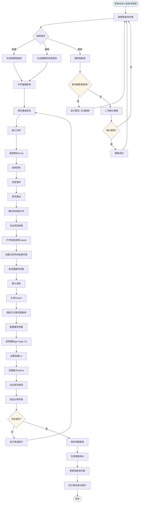

---

## 7. Skill配置流程图

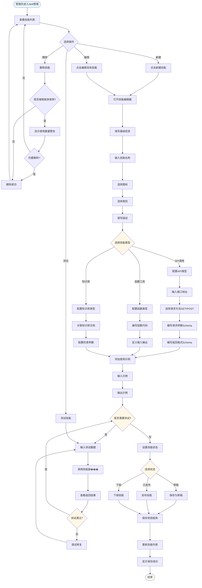

---

## 8. 数据流转关系图

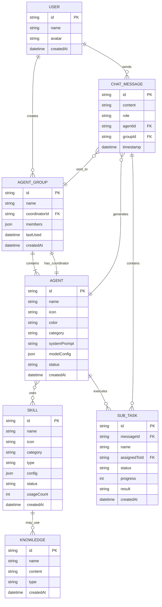

---

## 9. 前后台模块关系图

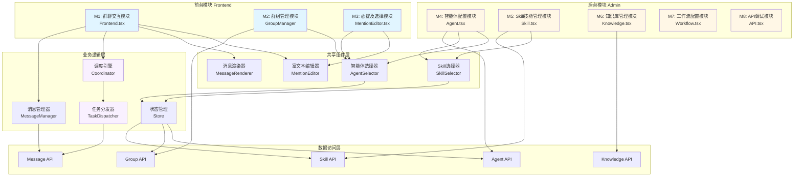

---

## 10. 消息发送与处理时序图

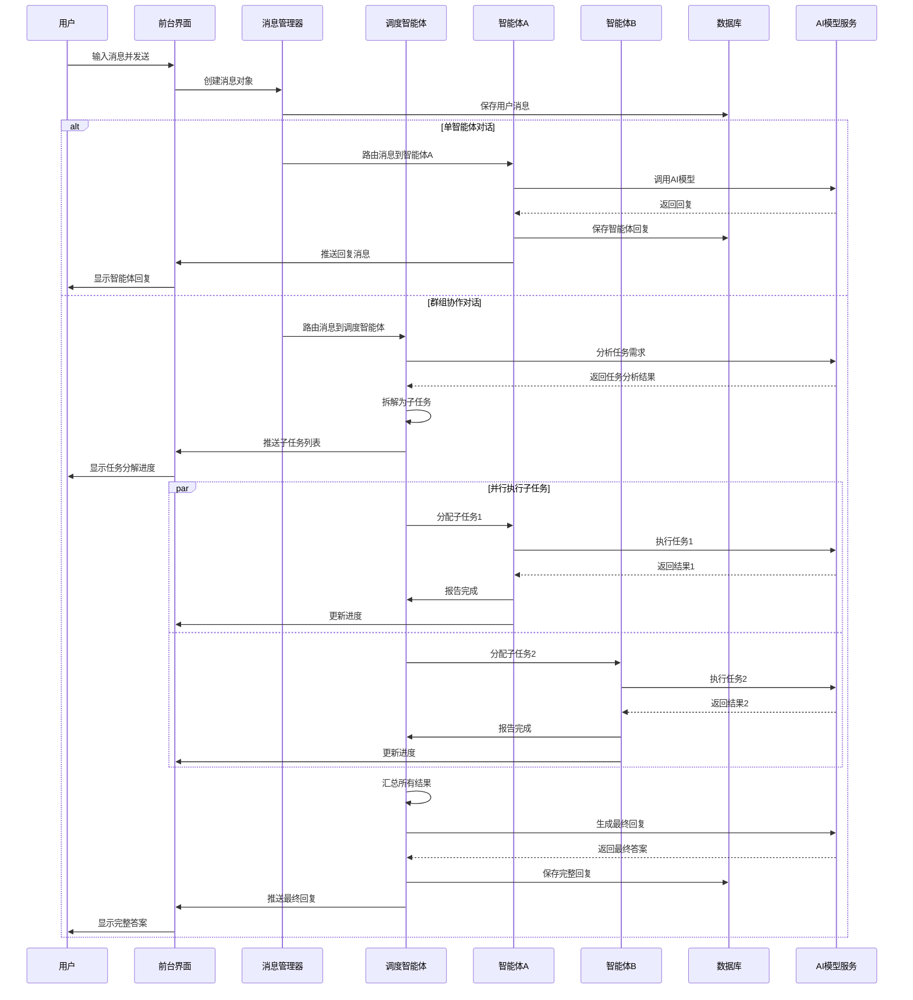

---

## 11. 系统状态流转图

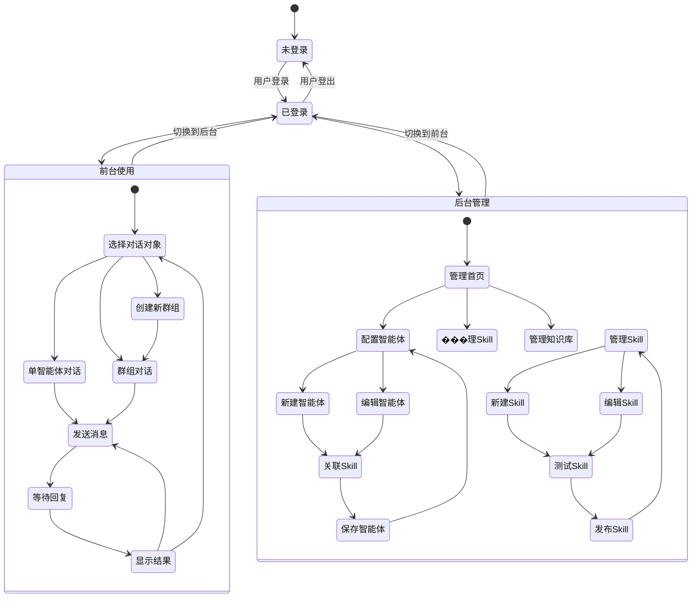

---

## 12. 技能调用流程图

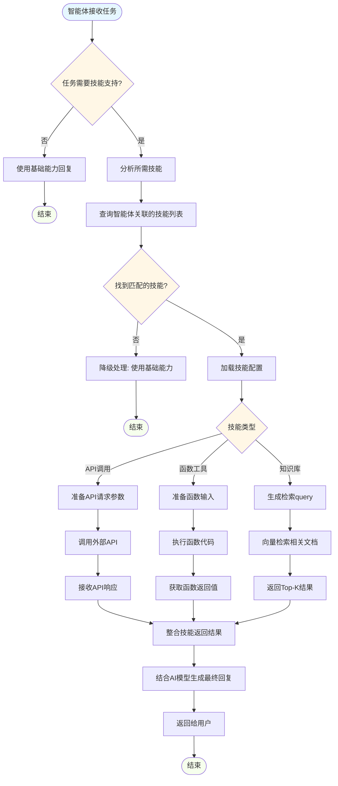

---

## 13. 权限与安全流程图

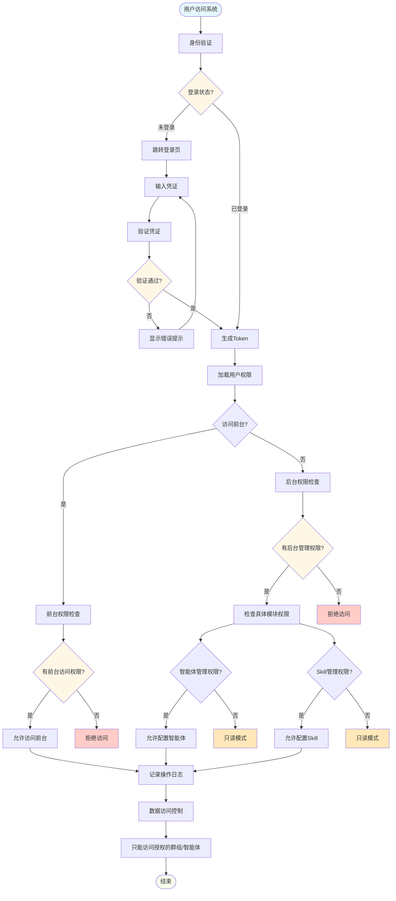

---

## 14. 错误处理与降级流程���

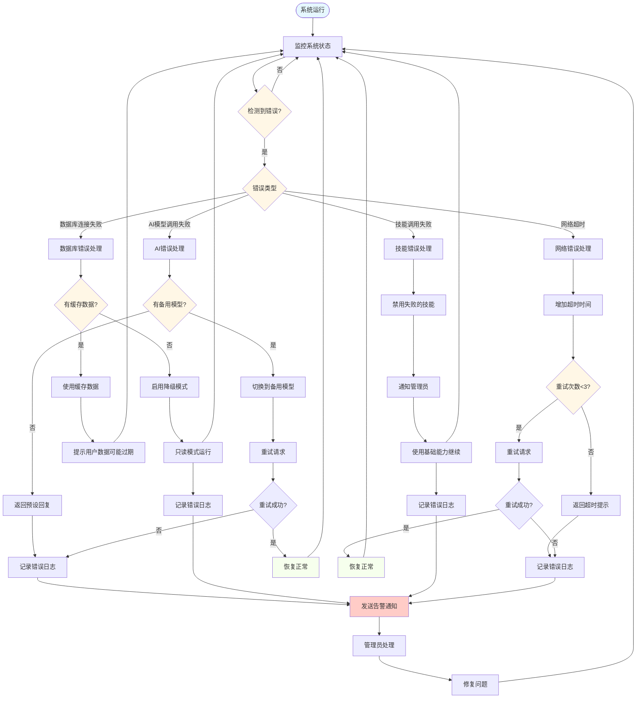

---

## 使用说明

本文档包含14个核心流程图，使用Mermaid语法编写，可以在支持Mermaid的Markdown编辑器中查看，推荐工具：

1. **在线工具**:
   - Mermaid Live Editor: https://mermaid.live/
   - GitHub/GitLab（原生支持）

2. **本地工具**:
   - Typora
   - VS Code + Mermaid扩展
   - Obsidian + Mermaid插件

3. **导出方式**:
   - PNG/SVG图片
   - PDF文档
   - HTML网页

---

**文档版本**: v1.0
**最后更新**: 2026-01-26
**文档状态**: ✅ 已完成